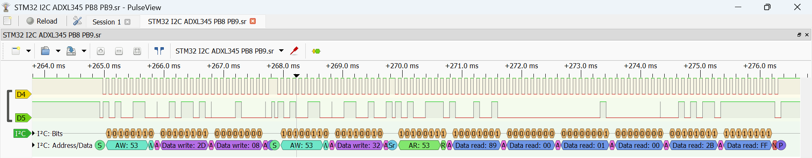

# STM32F411 Bare-Metal ADXL345 I2C Driver

A register-level implementation of an I2C Master driver for the ADXL345 accelerometer for the STM32F411CEU6. 

## Hardware Configuration

This firmware is configured to use **I2C1**:
* **PB8** -> SCL 
* **PB9** -> SDA
NOTE: PB6 and PB7 were previously used, however it suffered electrical damage due to lack of grounding. It is now reconfigured to use PB8 and PB9 instead, but can reconfigured back if desired in your board.

## Technical Specifications
- **Hardware:** STM32F411CEU6 "Black Pill"
- **Peripheral:** I2C1
- **Clock Speed:** 16 MHz HSI (Internal High Speed)
- **I2C Mode:** Standard Mode (100 kHz)
- **Timing Calculations:**
  - `CCR = 16MHz / (2 * 100kHz) = 80`
  - `TRISE = (1000ns / 62.5ns) + 1 = 17`

## Features
- **Zero-Abstraction:** No HAL or LL drivers used for the I2C transaction.
- **Burst Read:** Synchronized 6-byte read for X, Y, and Z axes to prevent data tearing.
- **Timeout Logic:** SysTick-based error handling to prevent bus lockup.
- **Modular Driver Design:** Decoupled hardware logic from main.c using a custom adxl345.h/c interface.
- [PLANNED] **Event-Driven:** CPU is only active when reading bytes.
- [PLANNED] **DMA:** Sending bytes to DMA controller to achieve higher energy efficiency.

## Repository Structure
- `/Core`: Main application logic and register configurations.
- `/Drivers/CMSIS`: Hardware register definitions.
- `/Docs`: Documentation regarding the project.
- `*.ioc`: STM32CubeMX configuration file.

## Protocol Verification

The waveform below illustrates a successful I2C transaction between the STM32 and the ADXL345:

*The raw digital capture session file can be found in `./Docs/"STM32 I2C ADXL345 PB8 PB9.sr"` and viewed directly in PulseView.*